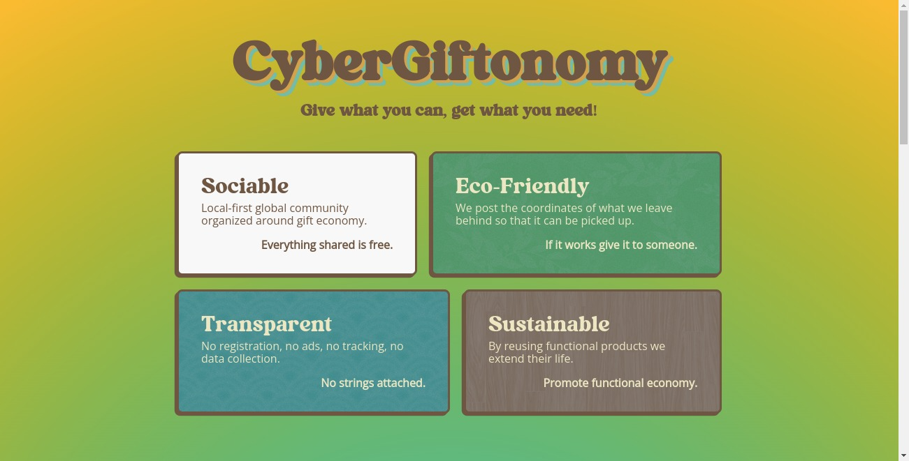
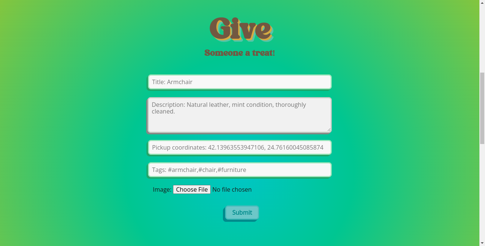
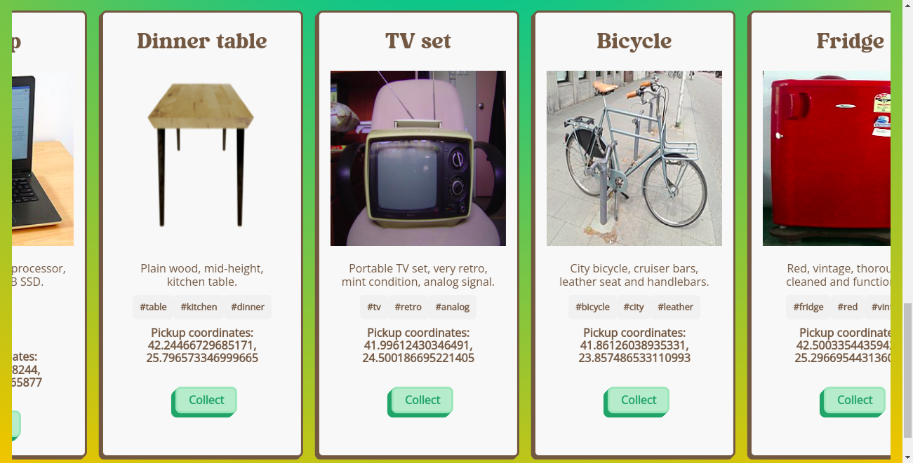
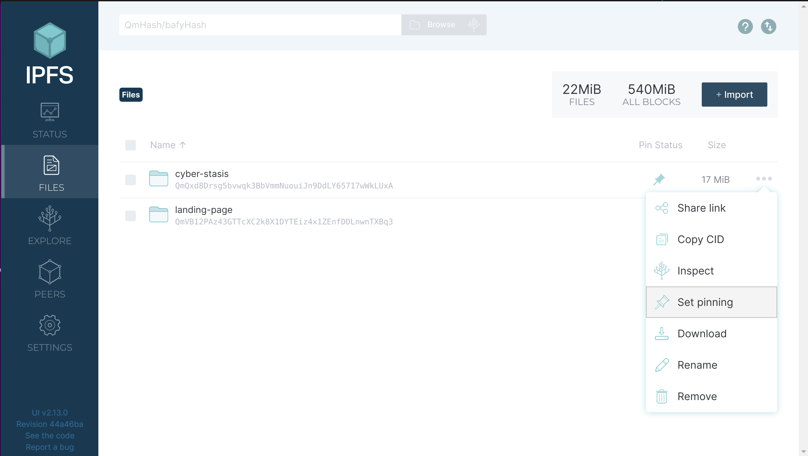

# Cyber Giftonomy


## Gift economy

A gift economy is an economic system based on gift-giving, in which goods or services get exchanged with no expectation of remuneration, reciprocity, or quid pro quo. Cyber Giftonomy brings that concept to the 21st century with direct p2p interactions.

## How does it work?

Submit the stuff you are giving away and post its coordinates. Anyone can pick it up anonymously without even meeting you up. Once someone collects it he/she clicks the button collected so that it's taken off the listing.

## Screenshots

<a display="inline" href="./assets/home.png?raw=true">

</a>

<a display="inline" href="./assets/give.png?raw=true">

</a>

<a display="inline" href="./assets/browse.png?raw=true">

</a>

## Community

https://www.reddit.com/r/CyberGiftonomy/

## How to Play

The game runs on the public IPFS network. In order to play it follow the steps below:

1. Install the official IPFS Desktop http://docs.ipfs.io/install/ipfs-desktop/
2. Install IPFS Companion http://docs.ipfs.io/install/ipfs-companion/
3. Install golang 1.17 or later version - https://go.dev/doc/install
4.  Clone https://github.com/stateless-minds/kubo to your local machine
```
git clone https://github.com/stateless-minds/kubo.git
```
5.  Follow the instructions here to open your config file: https://github.com/ipfs/kubo/blob/master/docs/config.md. Usually it's `~/.ipfs/config` on Linux. Add the following snippet to the `HTTPHeaders`:
```{
  "API": {
    "HTTPHeaders": {
      "Access-Control-Allow-Origin": ["webui://-", "http://localhost:3000", "http://k51qzi5uqu5dk32d3b06vug3radhkdh3i47vtbvzxbi2k7if8f2qahqidse46c.ipns.localhost:8080", "http://127.0.0.1:5001", "https://webui.ipfs.io"],
      "Access-Control-Allow-Credentials": ["true"],
      "Access-Control-Allow-Methods": ["PUT", "POST"]
    }
  },
 ```
6. Build it and start the daemon:
``` 
cd kubo
make build
./cmd/ipfs/ipfs daemon --enable-pubsub-experiment
```
7.  Navigate to <a href="https://ipfs.io/ipns/k51qzi5uqu5dk32d3b06vug3radhkdh3i47vtbvzxbi2k7if8f2qahqidse46c">Cyber Giftonomy</a>
8.  If you like the game consider pinning it to your local node so that you become a permanent host of it while you have IPFS daemon running



## Acknowledgments

1. <a href="https://go-app.dev/">go-app</a>
2. <a href="https://ipfs.io/">IPFS</a>
3. <a href="https://berty.tech/">Berty</a>
4. All the rest of the authors who worked on the dependencies used! Thanks a lot!

## Contributing

<a href="https://github.com/stateless-minds/cyber-giftonomy/issues">Open an issue</a>

## License

Stateless Minds (c) 2023 and contributors

MIT License
